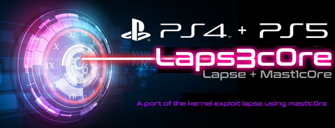

# Lapse + Mast1c0re = Laps3c0re!
A port of [Lapse](https://github.com/kmeps4/PSFree/blob/main/lapse.mjs), which is a kernel exploit implementation by **@abc**, using [Mast1c0re](https://github.com/McCaulay/mast1c0re) by [@McCaulay](https://github.com/McCaulay) as an entry point.

## Supported FWs

**PS4:**  
- [x] 9.00
- [x] 9.03 / 9.04
- [x] 9.50 / 9.51 / 9.60
- [x] 10.00 / 10.01
- [x] 10.50 / 10.70 / 10.71
- [x] 11.00
- [ ] 11.02 (TODO)
- [ ] 11.50 / 11.52 (TODO)
- [ ] 12.00 / 12.02 (TODO)
- [ ] ~~12.50 / 12.52 / ...~~ Unsupported, please revert or sell your console.

**PS5:**  
- TODO

## Setup Guide

### Pre-requisites:

- A PS4/PS5 on a supported FW version.
- A digital, activated copy of the game Okage: Shadow King, acquired from PSN.
- PS2 Network or USB ELF Loader. Pre-release builds made by [@EchoStretch](https://github.com/EchoStretch) can be found here: [mast1c0re-ps2-usb-elf-loader-505-1252.7z](https://www.mediafire.com/file/p9aii0yv68glkvd/mast1c0re-ps2-usb-elf-loader-505-1252.7z/file), [mast1c0re-ps2-network-elf-loader-505-1252.7z](https://www.mediafire.com/file/vfr9p1r83cx1fab/mast1c0re-ps2-network-elf-loader-505-1252.7z/file).
- Laps3c0re binaries, can be found in the [releases](https://github.com/iMrDJAi/laps3c0re/releases) section.

### Steps

- Follow this guide to have a modded Okage savegame with an ELF loader on your console: [Creating the save and adding the exploit data to it](https://consolemods.org/wiki/PS4:Jailbreak_With_Mast1c0re%2BLapse#Creating_the_save_and_adding_the_exploit_data_to_it).
- On a USB stick formatted as exFAT with MBR (GPT partitioning won't work), download the latest [GoldHEN](https://ko-fi.com/sistro/shop) and put `goldhen.bin` in the root of your USB. (TODO: A variation that loads `payload.bin`, or both, will be available soon). Then insert it into your console.
- For network loader:
  - Install [python3](https://www.python.org/downloads/), and the script dependencies: `pip install progress`.
  - Open Okage, press the `start` button (which is in reality just the right side of the touch pad), then select "RESTORE GAME".
  - Run the following command on your terminal to send the laps3c0re payload to your console: `python ./mast1c0re-send-file.py -i 192.168.x.xx -p 9045 -f ./laps3c0re-PSx-xx-xx.elf`. (Replace `192.168.x.xx` by your console IP and `laps3c0re-PSx-xx-xx.elf` by the binary corresponding to your console's FW version).
- For USB loader:
  - Copy `laps3c0re-PSx-xx-xx.elf` that corresponds to your console's FW to the `ELFs/` directory in your USB stick. Then insert it into your console. See this [example](https://github.com/McCaulay/mast1c0re-ps2-usb-elf-loader?tab=readme-ov-file#configuring-a-usb).
  - Open Okage, press the `start` button (which is in reality just the right side of the touch pad), then select "RESTORE GAME". Finally, follow the prompt to load Laps3c0re.

- To receive logs, run the command `ncat --udp --listen --keep-open --recv-only -p 9023` from a computer running at the IP address `192.168.1.39`. You'll need to have [NetCat](https://nmap.org/download) installed.

**Note:** Soon, Laps3c0re will be available in a stand-alone savegame format, eliminating the need for an ELF loader.

## FAQ

(TODO)

## Credit

Thanks for everyone who made this possible:

- **@abc** for the initial implementation of Lapse. 🫡
- [@McCaulay](https://github.com/McCaulay) and [@cturt](https://github.com/cturt) for their work on Mast1c0re.
- [@Dr.Yenyen](https://github.com/DrYenyen) for extensive testing (a true legend).
- [@Wr0zen](https://x.com/Wr0zen) for testing as well (you might not remember but you're the one who signed the savegame for me back then :3).
- [@EchoStretch](https://github.com/EchoStretch) for porting the ELF loaders to higher FWs.
- [@theOfficialFloW](https://github.com/TheOfficialFloW) for his work on PPPwn which I have inspired a lot from it.
- The [contributors](https://github.com/shahrilnet/remote_lua_loader/graphs/contributors) behind Lapse/LUA which I used as a second reference.
- [@notnotzecoxao](https://x.com/notnotzecoxao) for providing valuable help and supporting the scene as a whole.
- [@aldostools](https://x.com/aldostools) for the awesome cover image he made.
- [@SiSTR0](https://github.com/SiSTR0) and the contributors behind GoldHEN.
- [@me](https://github.com/iMrDJAi) for this port and kernel diffing that lead to the discovery of the double free bug in `aio_multi_delete()`.
- And everyone else involved.

## Licensing

- Laps3c0re is licensed under [GNU AFFERO GENERAL PUBLIC LICENSE](LICENSE) version 3 or later.
- The distributed binaries contain portions of code derived from MIT-licensed projects; you will receive a copyright [NOTICE](bin/NOTICE) for full details.
